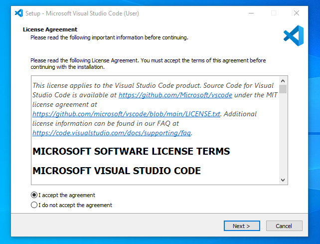

# Dev_Setup
Setup Development Environment

#Assignment: Setting Up Your Developer Environment

#Objective:
This assignment aims to familiarize you with the tools and configurations necessary to set up an efficient developer environment for software engineering projects. Completing this assignment will give you the skills required to set up a robust and productive workspace conducive to coding, debugging, version control, and collaboration.

#Tasks:

1. Select Your Operating System (OS):
   Choose an operating system that best suits your preferences and project requirements. Download and Install Windows 11. https://www.microsoft.com/software-download/windows11
   My laptop cannot upgrade to windows 11, so the following will be on installing windows 10.

Step 1:  Open your browser,https://www.microsoft.com/en-gb/software-download/windows10  download. Once the download is complete, open the file by  clicking on it.

Step 2: Once you open it, a pop up will appear and will ask you whether you accept or decline the licence terms. Select Accept by clicking on it.

Step 3: Choose Create installation media and click Next.

Step 4: Click Next.

Step 5: Choose USB flash drive and click Next to proceed.
Choose usb flash drive to boot windows 10

Step 6: Plug your USB Device into the PC. Wait while it reads the file

Step 7: Select the drive to install Windows and click Next. This will erase and reformat the drive. Select a usb flash drive to install windows 10

Step 8: Windows 10 is now being downloaded into your USB device. Wait until this process finishes and close the setup window. Download windows 10

Step 9: Plug your USB Device (as a bootable device now) with Windows 10 installer into a new PC.

Step 10: Turn on your new computer and access the BIOS/UEFI (typically using F2, F10, or Del). Change boot order.

Step 11: In BIOS/UEFI, set the USB flash drive as the first boot option.

Step 12: Save changes and exit. Your PC will reboot from the USB drive.

Step 13: When the Windows Setup appears, select language, time/currency format, etc. then choose Next. Setup windows 10 installation.

Step 14: After that, Click Install Now and follow the prompts to set up Windows. Install now windows 10

Source: WPS
https://www.wps.com/blog/how-to-install-windows-10-step-by-step-guide/

3. Install a Text Editor or Integrated Development Environment (IDE):
   Select and install a text editor or IDE suitable for your programming languages and workflow. Download and Install Visual Studio Code. https://code.visualstudio.com/Download

A step-by-step guide to download and install Visual Studio Code:

Step 1: Using google chrome, visit the official website https://code.visualstudio.com/docs/?dv=win.

Step 2: Select the ‘download for windows’ option so that the download can commence.

Step 3: When the download finishes, then the Visual Studio Code setup will appear in the downloads folder. Double click on the icon to run the installer.

Step 4:  Launch Visual Studio Code. After installation, open Visual Studio Code.

Step 5: After the Installer opens, it will ask you to accept the terms and conditions of the Visual Studio Code. Click on ‘I accept’ the agreement and then click the Next button.

 
Step 6: Choose the location data for running the Visual Studio Code. It will then ask you to browse the location. Then click on the Next button.

Step 7: Then it will ask to begin the installation setup. Click on the Install button.

Step 8: After clicking on Install, it will take about 1 minute to install the Visual Studio Code on your device.

Step 9: After the Installation setup for Visual Studio Code is finished, it will show a window like this below. Tick the “Launch Visual Studio Code” checkbox and then click Next.

Step 10: After the previous step, the Visual Studio Code window opens successfully. Now you can create a new file in the Visual Studio Code window and choose a language of yours to begin your programming journey.

Source: Geeks for Geeks
https://www.geeksforgeeks.org/how-to-install-visual-studio-code-on-windows/

   
5. Set Up Version Control System:
   Install Git and configure it on your local machine. Create a GitHub account for hosting your repositories. Initialize a Git repository for your project and make your first commit. https://github.com

I started first by creating a GitHub account and these were the steps

Step 1: I searched for GitHub on my google chrome browser and opened the GitHub homepage: [https://github.com]
Step 2: To Sign Up for a New Account.  Click on the "Sign up" button located at the top right corner of the page. 
Step 3: Enter Your Details
   - Username: Choose a unique username that will represent you on GitHub. My username is Mosapi25.
   - Email Address: Enter your email address. This will be used for account verification and notifications.
   - Password: Create a strong password that you will use to log in to your GitHub account.

Step 4: Complete the CAPTCHA
Complete the CAPTCHA challenge to prove you are not a robot.

Step 5: Choose a Plan
GitHub offers both free and paid plans. Select the "Free" plan if you are just starting out. You can always upgrade later if you need more features.

Step 6: Verify Your Email Address
GitHub will send a verification email to the address you provided. Go to your email inbox, open the verification email, and click the "Verify email address" button.

Step 7: Explore and start using GitHub
Once your email is verified, you can start exploring GitHub. You may be guided through a brief tutorial on how to use GitHub, including creating your first repository and exploring existing projects.

Downloading and Installing Git 

1. Download Git
Go to the Git for Windows download page.
Click on the download link to get the latest version of the Git installer.

2. Run the Git Installer
Locate the downloaded Git-*-*-*-*-.exe file in your downloads folder and double-click it to start the installation process.

Follow the installation prompts:
Select Destination Location: Choose the default or a preferred location for installing Git.

Select Components: Check the components you want to install (leave the default selections as is). This usually includes Git Bash and Git GUI.
Adjusting your PATH environment: Select "Git from the command line and also from 3rd-party software".

Choosing the SSH executable: Select "Use bundled OpenSSH".

Choosing HTTPS transport backend: Select "Use the OpenSSL library".

Configuring the line ending conversions: Select "Checkout Windows-style, commit Unix-style line endings".

Configure the terminal emulator to use with Git Bash: Select "Use MinTTY (the default terminal of MSYS2)".

Choosing the default Git branch name: Select "Let Git decide" or "Override the default branch name for new repositories" if you prefer a specific branch name.

Configuring extra options: Leave the default options checked (enable file system caching and Git Credential Manager).

Configuring experimental options: You can choose to enable experimental features or leave them unchecked.

Click "Install" to begin the installation.
After the installation completes, click "Finish" to close the installer.

3. Verify Git Installation
Open Command Prompt or Git Bash.
Type the following command and press Enter:
git --version
You should see the installed version of Git, confirming that Git is 
installed correctly.

4. Configure Git
Open Git Bash.
Set your username:
git config --global user.name "Your Name"
Set your email:
git config --global user.email "your.email@example.com"
Optionally, set the default text editor (e.g., VS Code):
git config --global core.editor "code --wait"
Verify the configuration:
git config --list
Verify the configuration:
git config --list

Initialising a Git Repository and Make Your First Commit

1. Open Git Bash or Command Prompt
- You can use either Git Bash (installed with Git) or Command Prompt to run the Git commands.

 2. Navigate to Your Project Directory
- Use the `cd` command to navigate to your project's directory. Replace `path/to/your/project` with the actual path to your project folder.
 - cd path/to/your/project
  
3. Initialise a New Git Repository

- Initialize an empty Git repository in your project directory.
  - git init
  
- This command creates a new subdirectory named `.git` in your project directory, which contains all the necessary repository files.

 4. Add Files to the Repository

- Add all the files in your project directory to the staging area. You can use the `git add .` command to add all files, or specify individual files.
 - git add .
  
5. Check the Status of Your Repository
- Check the status of your repository to see the changes that are staged for the first commit.
  -git status
  
6. Make Your First Commit
- Commit the staged changes to the repository with a descriptive commit message.
 - git commit -m "Initial commit"
  
Source: https://phoenixnap.com/kb/how-to-install-git-windows

6. Install Necessary Programming Languages and Runtimes:
Instal Python from http://wwww.python.org programming language required for your project and install their respective compilers, interpreters, or runtimes. Ensure you have the necessary tools to build and execute your code.

Step-by-Step Guide to Install Python
1. Download Python
Go to the official Python website: https://www.python.org/, and download the latest version of the Python installer for Windows.

3. Install Python

Step 2: Run the Python Installer
Locate the downloaded python-*.exe file in your downloads folder and double-click it to start the installation process.

Step 3: . Customise Installation
Add Python to PATH:

Check the box labelled "Add Python to PATH" at the bottom of the installer window.
Customise Installation:
Step 4: Optional Features
Ensure the following optional features are checked:
Documentation
pip
tcl/tk and IDLE
Python test suite
py launcher
For all users (requires admin privileges)
 Then Click "Next".

Step 5: Advanced Options
Select the following advanced options:

Install for all users (requires admin privileges)
Associate files with Python (requires the py launcher)
Create shortcuts for installed applications
Add Python to environment variables
Precompile standard library
Optionally, you can customise the installation location, but the default is usually fine:

C:\Program Files\Python39\
Click "Install".

Step 6: Complete Installation
The installer will proceed with the installation. Once completed, click "Close".

step 7: Verify Installation
Open PowerShell.

Verify Python installation:
python --version

Verify pip installation:
pip --version

8. Install Package Managers:
   If applicable, install package managers like pip (Python).
Installing pip for Python
pip is the standard package manager for Python. It is usually installed by default with Python, but if it's not, you can install it manually.

Step 1. Check if pip is Already Installed
Open your terminal or command prompt and run:
pip --version

Step 2. Install pip if Necessary
For Windows
If pip is not installed, download the get-pip.py script:
curl https://bootstrap.pypa.io/get-pip.py -o get-pip.py

Run the script with Python:
python get-pip.py

Alternatively, if you have python3, you can use:
python3 get-pip.py

Step 3. Verify pip Installation
Check the pip version again to ensure it's installed:
pip --version

9. Configure a Database (MySQL):
   Download and install MySQL database. https://dev.mysql.com/downloads/windows/installer/5.7.html

Step 1: Download MySQL
Visit the MySQL Downloads page and select the latest version of MySQL which is relevant for your PC.

Step 2: Install MySQL

Download the MySQL Installer for Windows.
Run the installer and choose the "Developer Default" setup type to install MySQL Server, MySQL Workbench, and other useful tools.

Follow the setup instructions:
Configure MySQL Server: Choose the default settings unless you have specific requirements.

Set up a root password and create a user (optional).
Start MySQL Server.

Step 3: MySQL Installation
Run the security script to improve the security of your MySQL installation:
sudo mysql_secure_installation

Follow the prompts to set up a root password, remove anonymous users, disallow root login remotely, remove test databases, and reload the privilege tables.

Step 4: Connect to MySQL
Open your terminal or command prompt and log in to the MySQL server as the root user:
mysql -u root -p
Enter the root password you set during the installation process.

Step 5: Create a Database and User
Once logged in, you can create a new database and a new user with the following commands:
CREATE DATABASE mydatabase;
CREATE USER 'myuser'@'localhost' IDENTIFIED BY 'mypassword';
GRANT ALL PRIVILEGES ON mydatabase.* TO 'myuser'@'localhost';
FLUSH PRIVILEGES;

Step 6: Install MySQL Workbench 
MySQL Workbench is a visual tool for managing MySQL databases. You can download it from the MySQL Workbench Downloads page.
Install MySQL Workbench and open it.
Create a new connection to your MySQL server using the root or newly created user credentials.

10. Set Up Development Environments and Virtualization (Optional):
   Consider using virtualization tools like Docker or virtual machines to isolate project dependencies and ensure consistent environments across different machines.

Installing Docker

1. Install Docker
Go to the Docker Desktop download page and download the installer for your operating system.
Run the installer and follow the installation prompts.
After installation, Docker Desktop will start automatically.

2. Verify Docker Installation
Open your terminal or command prompt and run:
docker --version

To check if Docker is running correctly, run:
docker run hello-world
This command downloads a test image and runs it in a container. If Docker is installed correctly, you’ll see a "Hello from Docker!" message.
3. Create a Dockerfile
A Dockerfile is a script that contains instructions to build a Docker image. Create a file named Dockerfile in your project directory with the following content as an example:
# Use an official Python runtime as a parent image
FROM python:3.9-slim

# Set the working directory in the container
WORKDIR /usr/src/app

# Copy the current directory contents into the container at /usr/src/app
COPY . .

# Install any needed packages specified in requirements.txt
RUN pip install --no-cache-dir -r requirements.txt

# Make port 80 available to the world outside this container
EXPOSE 80

# Define environment variable
ENV NAME World

# Run app.py when the container launches
CMD ["python", "./app.py"]

4. Build and Run the Docker Container
Build the Docker image from the Dockerfile:
docker build -t my-python-app .
Run the Docker container:
docker run -p 4000:80 my-python-app

11. Explore Extensions and Plugins:
Explore available extensions, plugins, and add-ons for your chosen text editor or IDE to enhance functionality, such as syntax highlighting, linting, code formatting, and version control integration.

Enhancing Visual Studio Code with Extensions
1. Open the Extensions View in VS Code
Open VS Code.
Click on the Extensions view icon on the Sidebar or press Ctrl+Shift+X (Windows/Linux) or Cmd+Shift+X (macOS).
2. Search for Extensions
Use the search bar at the top of the Extensions view to find specific extensions or browse through the popular and recommended ones.

4. Install Extensions
Click the "Install" button next to the extension you want to add.
After installation, you may need to reload VS Code to activate the extension.
Recommended Extensions for VS Code

1. Python
Name: Python
Features: Provides rich support for Python including IntelliSense (Pylance), linting, debugging, code formatting, Jupyter Notebooks, and more.
Installation: Search for "Python" in the Extensions view and install the extension by Microsoft.

Managing Extensions
Enable/Disable Extensions
Right-click on an installed extension in the Extensions view and select "Disable" or "Enable".

Uninstall Extensions
Right-click on an installed extension and select "Uninstall".

13. Document Your Setup:
    Create a comprehensive document outlining the steps you've taken to set up your developer environment. Include any configurations, customizations, or troubleshooting steps encountered during the process. 

#Deliverables:
- Document detailing the setup process with step-by-step instructions and screenshots where necessary.
- A GitHub repository containing a sample project initialized with Git and any necessary configuration files (e.g., .gitignore).
https://github.com/Mosapi25/assignment-sample.git
  
- A reflection on the challenges faced during setup and strategies employed to overcome them.
  My challenges and how I overcame them:
   
I encountered a problem with installing MySQL whereby the password I had set up was not working once I wanted to use Workbench. What I did was to uninstall MySQL at the control panel settings. I then attempted to install it again, that is when it said the file already exist in my drive. I went to my PC's program files and deleted the MySQL files and proceeded to install MySQL.

#Submission:
Submit your document and GitHub repository link through the designated platform or email to the instructor by the specified deadline.

#Evaluation Criteria:**
- Completeness and accuracy of setup documentation.
- Effectiveness of version control implementation.
- Appropriateness of tools selected for the project requirements.
- Clarity of reflection on challenges and solutions encountered.
- Adherence to submission guidelines and deadlines.

Note: Feel free to reach out for clarification or assistance with any aspect of the assignment.
